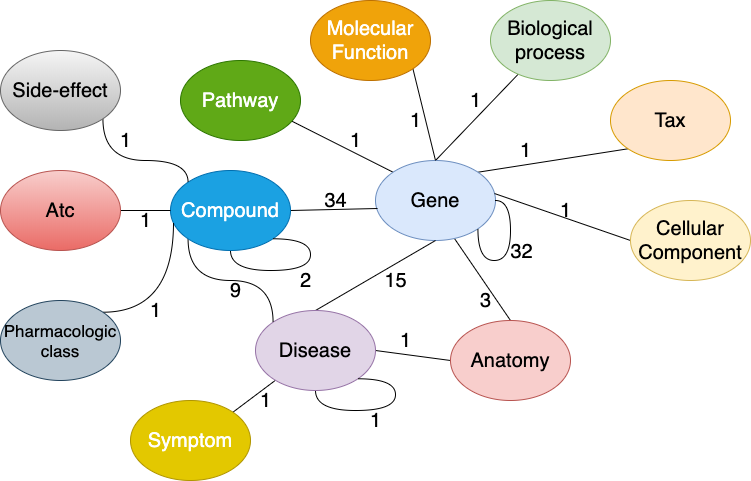

# Drug Repurposing Knowledge Graph (DRKG)
Drug Repurposing Knowledge Graph (DRKG) is a comprehensive biological knowledge graph relating genes, compounds, diseases, biological processes, side effects and symptoms. DRKG includes information from six existing databases including DrugBank, Hetionet, GNBR, String, IntAct and DGIdb, and data collected from recent publications particularly related to Covid19. It includes 97,238 entities belonging to 13 entity-types; and 5,874,261 triplets belonging to 107 edge-types. These 107 edge-types show a type of interaction between one of the 17 entity-type pairs (multiple types of interactions are possible between the same entity-pair), as depicted in the figure below. It also includes a bunch of notebooks about how to explore and analysis the DRKG using statistical methodologies or using machine learning methodologies such as knowledge graph embedding.


<p align="center">
  
  <br>
  <b>Figure</b>: Interactions in the DRKG. The number next to an edge indicates the number of relation-types for that entity-pair in DRKG.
</p>

## Statistics of DRKG
The type-wise distribution of the entities in DRKG and their original data-source(s) is shown in following table. 

| Entity type         | Drugbank | GNBR  | Hetionet | STRING | IntAct | DGIdb | Bibliography | Total Entities |
|:--------------------|---------:|------:|---------:|-------:|-------:|------:|-------------:|---------------:|
| Anatomy             | \-       | \-    | 400      | \-     | \-     | \-    | \-           | 400            |
| Atc                 | 4,048     | \-    | \-       | \-     | \-     | \-    | \-           | 4,048           |
| Biological Process  | \-       | \-    | 11,381    | \-     | \-     | \-    | \-           | 11,381          |
| Cellular Component  | \-       | \-    | 1,391     | \-     | \-     | \-    | \-           | 1,391           |
| Compound            | 9,708     | 11,961 | 1,538     | \-     | 153    | 6,348  | 6,250         | 24,313          |
| Disease             | 1,182     | 4,746  | 257      | \-     | \-     | \-    | 33           | 5,103           |
| Gene                | 4,973     | 27,111 | 19,145    | 18,316  | 16,321  | 2,551  | 3,181         | 39,220          |
| Molecular Function  | \-       | \-    | 2,884     | \-     | \-     | \-    | \-           | 2,884           |
| Pathway             | \-       | \-    | 1,822     | \-     | \-     | \-    | \-           | 1,822           |
| Pharmacologic Class | \-       | \-    | 345      | \-     | \-     | \-    | \-           | 345            |
| Side Effect         | \-       | \-    | 5,701     | \-     | \-     | \-    | \-           | 5,701           |
| Symptom             | \-       | \-    | 415      | \-     | \-     | \-    | \-           | 415            |
| Tax                 | \-       | 215   | \-       | \-     | \-     | \-    | \-           | 215            |
| Total               | 19,911   | 44,033 | 45,279    | 18,316  | 16,474  | 8,899  | 9,464         | 97,238          |


The following table shows the number of triplets between different entity-type pairs in DRKG for DRKG and various datasources.

| Entity\-type pair                     | Drugbank | GNBR   | Hetionet | STRING  | IntAct | DGIdb | Bibliography | Total interactions |
|:--------------------------------------|-----------:|-------:|---------:|--------:|-------:|------:|-------------:|-------------------:|
| \(Gene, Gene\)                    | \-         | 66,722  | 474,526   | 1,496,708 | 254,346 | \-    | 58,629        | 2,350,931            |
| \(Compound, Gene\)                | 24,801      | 80,803  | 51,429    | \-      | 1,805   | 26,290 | 25,666        | 210,794             |
| \(Disease, Gene\)                 | \-         | 95,399  | 27,977    | \-      | \-     | \-    | 461          | 123,837             |
| \(Atc, Compound\)                 | 15,750      | \-     | \-       | \-      | \-     | \-    | \-           | 15,750              |
| \(Compound, Compound\)            | 1,379,271    | \-     | 6,486     | \-      | \-     | \-    | \-           | 1,385,757            |
| \(Compound, Disease\)             | 4,968        | 77,782  | 1,145     | \-      | \-     | \-    | \-           | 83,895              |
| \(Gene, Tax\)                     | \-         | 14,663  | \-       | \-      | \-     | \-    | \-           | 14,663              |
| \(Biological Process, Gene\)      | \-         | \-     | 559,504   | \-      | \-     | \-    | \-           | 559,504             |
| \(Disease, Symptom\)              | \-         | \-     | 3,357     | \-      | \-     | \-    | \-           | 3,357               |
| \(Anatomy, Disease\)              | \-         | \-     | 3,602     | \-      | \-     | \-    | \-           | 3,602               |
| \(Disease, Disease\)              | \-         | \-     | 543      | \-      | \-     | \-    | \-           | 543                |
| \(Anatomy, Gene\)                 | \-         | \-     | 726,495   | \-      | \-     | \-    | \-           | 726,495             |
| \(Gene, Molecular Function\)      | \-         | \-     | 97,222    | \-      | \-     | \-    | \-           | 97,222              |
| \(Compound, Pharmacologic Class\) | \-         | \-     | 1,029     | \-      | \-     | \-    | \-           | 1,029               |
| \(Cellular Component, Gene\)      | \-         | \-     | 73,566    | \-      | \-     | \-    | \-           | 73,566              |
| \(Gene, Pathway\)                 | \-         | \-     | 84,372    | \-      | \-     | \-    | \-           | 84,372              |
| \(Compound, Side Effect\)         | \-         | \-     | 138,944   | \-      | \-     | \-    | \-           | 138,944             |
| Total                                 | 1,424,790    | 335,369 | 2,250,197  | 1,496,708 | 256,151 | 26,290 | 84,756        | 5,874,261            |


## Download DRKG
To analyze DRKG, you can directly download drkg by following commands:
```
wget https://dgl-data.s3-us-west-2.amazonaws.com/dataset/DRKG/drkg.tar.gz
```
If you use our notebooks provided in this repository, you don't need to download the file manually. The notebooks can automatically download the file for you.

When you untar `drkg.tar.gz`, you will see the following files:

```
./drkg.tsv
./entity2src.tsv
./relation_glossary.tsv
./embed
./embed/DRKG_TransE_l2_relation.npy
./embed/relations.tsv
./embed/entities.tsv
./embed/Readme.md
./embed/DRKG_TransE_l2_entity.npy
./embed/mol_contextpred.npy
./embed/mol_masking.npy
./embed/mol_infomax.npy
./embed/mol_edgepred.npy
```

### DRKG dataset
The whole dataset contains four part:
 - drkg.tsv, a tsv file containing  the original drkg in the format of (h, r, t) triplets.
 - embed, a folder containing the pretrained Knowledge Graph Embedding using the entire drkg.tsv as the training set and pretrained GNN-based molecule embeddings from [molecule SMILES](./drugbank_info/drugbank_smiles.txt)
 - entity2src.tsv, a file mapping entities in drkg to their original sources.
 - relation_glossary.tsv, a file containing rge glossary of the relations in DRKG, and other associated information with sources (if available).

### Pretrained DRKG embedding
The DRKG mebedding is trained using TransE\_l2 model with dimention size of 400, there are four files:

 - DRKG\_TransE\_l2\_entity.npy, NumPy binary data, storing the entity embedding
 - DRKG\_TransE\_l2\_relation.npy, NumPy binary data, storing the relation embedding
 - entities.tsv, mapping from entity\_name to tentity\_id.
 - relations.tsv, mapping from relation\_name to relation\_id
 
To use the pretrained embedding, one can use np.load to load the entity embeddings and relation embeddings separately:

```
import numpy as np
entity_emb = np.load('./embed/DRKG_TransE_l2_entity.npy')
rel_emb = np.load('./embed/DRKG_TransE_l2_relation.npy')
```

### Pretrained Molecule Embedding

We also provide molecule embeddings for most small-molecule drugs in DrugBank using pre-trained GNNs. In particular, 
[Strategies for Pre-training Graph Neural Networks](https://arxiv.org/abs/1905.12265) develops multiple approaches for 
pre-training GNN-based molecular representations, combining supervised molecular property prediction with 
self-supervised learning approaches. We employ their method to compute four variants of molecule embeddings 
using [DGL-LifeSci](https://github.com/awslabs/dgl-lifesci/tree/master/examples/molecule_embeddings).

- `mol_contextpred.npy`: From a model pre-trained to predict surrounding graph structures of molecular subgraphs
- `mol_infomax.npy`: From a model pre-trained to maximize the mutual information between local node representations 
and a global graph representation
- `mol_edgepred.npy`: From a model pre-trained to encourage nearby nodes to have similar representations and enforcing 
disparate notes to have distinct representations
- `mol_masking.npy`: From a model pre-trained to predict randomly masked node and edge attributes

## Tools to analyze DRKG
We analyze DRKG with some deep learning frameworks, including [DGL](https://github.com/dmlc/dgl) (a framework for graph neural networks) and [DGL-KE](https://github.com/awslabs/dgl-ke) (a library for computing knowledge graph embeddings). Please follow the instructions below to install the deep learning frameworks.

### Install PyTorch
Currently all notebooks use PyTorch as Deep Learning backend. For install other version of pytorch please goto [Install PyTorch](https://pytorch.org/)
```
sudo pip3 install torch==1.5.0+cu101 torchvision==0.6.0+cu101 -f https://download.pytorch.org/whl/torch_stable.html
```

### Install DGL 
Please install [DGL](https://www.dgl.ai/) (a framework for graph neural networks) with the following command. It installs DGL with CUDA support.
```
sudo pip3 install dgl-cu101
```
For installing other versions of DGL, please go to [Install DGL](https://docs.dgl.ai/en/latest/install/index.html)

### Install DGL-KE
If you want to training the model with notebooks (e.g., using Train_embeddings.ipynb or Edge_score_analysis.ipynb) at [knowledge-graph-embedding-based-analysis-of-drkg], you need to install both DGL and [DGL-KE](https://github.com/awslabs/dgl-ke) package here.
DGL-KE can work with DGL >= 0.4.3 (either CPU or GPU)
```
sudo pip3 install dglke
```

## Notebooks for analyzing DRKG
We provide a set of notebooks to analyze DRKG. Some of the notebooks use the tools installed in the previous section.

### Basic Graph Analysis of DRKG
To evaluate the structural similarity among a pair of relation types we compute their Jaccard similarity coefficient and the overlap among the two edge types via the overlap coeffcient. This analysis is given in
 - [Jaccard_scores_among_all_edge_types_in_DRKG.ipynb](raw_graph_analysis/Jaccard_scores_among_all_edge_types_in_DRKG.ipynb)

### Knowledge Graph Embedding Based Analysis of DRKG
We analyze the extracted DRKG by learning a TransE KGE model that utilizes the  distance. As DRKG combines information from different data sources, we want to verify that meaningful entity and relation embeddings can be generated using knowledge graph embedding technology.

We split the edge triplets in training, validation and test sets as follows 90%, 5%, and 5% and train the KGE model as shown in following notebook:
- [Train_embeddings.ipynb](embedding_analysis/Train_embeddings.ipynb)

Finally, we obtain the entity and relation embeddings for the DRKG. We can do various embedding based analysis as provided in the following notebooks:
 - [Relation_similarity_analysis.ipynb](embedding_analysis/Relation_similarity_analysis.ipynb), analyzing the generate relation embedding similarity.
 - [Entity_similarity_analysis.ipynb](embedding_analysis/Entity_similarity_analysis.ipynb), analyzing the generate entity embedding similarity.
 - [Edge_score_analysis.ipynb](embedding_analysis/Edge_score_analysis.ipynb), evaluating whether the learned KGE model can predict the edges of DRGK
 - [Edge_similarity_based_on_link_recommendation_results.ipynb](embedding_analysis/Edge_similarity_based_on_link_recommendation_results.ipynb), evaluating how similar are the predicted links among different relation types.

### Drug Repurposing Using Pretrained Model for COVID-19
We present an example of using pretrained DRKG model for drug repurposing for COVID-19. In the example, we directly use the pretrained model provided at [DRKG dataset](#drkg-dataset) and proposed 100 drugs for COVID-19. The following notebook provides the details:

 - [COVID-19_drug_repurposing.ipynb](drug_repurpose/COVID-19_drug_repurposing.ipynb)

### DRKG with DGL
We provide a notebook, with example of using DRKG with Deep Graph Library (DGL).

The following notebook provides an example of building a heterograph from DRKG in DGL; and some examples of queries on the DGL heterograph:
 - [loading_drkg_in_dgl.ipynb](drkg_with_dgl/loading_drkg_in_dgl.ipynb)

## Additional Information for DrugBank

Some additional information about compounds from DrugBank is included in [drugbank_info](/drugbank_info), including the 
type and weight of drugs, and the SMILES of small-molecule drugs.

## Licence
This project is licensed under the Apache-2.0 License. However, the DRKG integrates data from many resources and users should consider the licensing of each source (see this [table](https://github.com/shuix007/COVID-19-KG/blob/master/licenses/Readme.md)) . We apply a license attribute on a per node and per edge basis for sources with defined licenses. 

## Cite

Please cite our dataset if you use this code and data in your work.

```
@misc{drkg2020,
  author = {Ioannidis, Vassilis N. and Song, Xiang and Manchanda, Saurav and Li, Mufei and Pan, Xiaoqin
            and Zheng, Da and Ning, Xia and Zeng, Xiangxiang and Karypis, George},
  title = {DRKG - Drug Repurposing Knowledge Graph for Covid-19},
  howpublished = "\url{https://github.com/gnn4dr/DRKG/}",
  year = {2020}
}
```
A preprint describing this work will be available soon.

